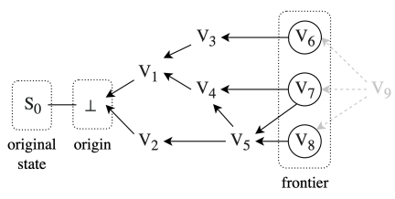
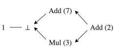

# Hash Graphs

Topology's **hash graph** approach works by encoding an operation history in a **directed acyclic graph** where the edges represent *causal dependency reporting* among the operations and the vertices contain the operations and the hashes of their causal dependencies, which we can define as a tuple (*u*, **D**), where *u* is the operation and **D** is the set of hashed vertices that are its causal dependencies.

Therefore, if *u* is an update operation, given two operations *u1* and *u2*, if *u2* reported *u1* as its causal dependency, *u2* must have happened after *u1* (*u2* &rarr; *u1*).

Here is an example of a CRO's hash graph:

    

    **Figure 1:** Hash graph of a CRO.

In the example above, the vertex *V7* should contain (*u7*, \{*h(V4)*, *h(V5)*}). The set of vertices \{*V6*, *V7*, *V8*} consists on the *frontier*, which are the vertices whose operations are currently not the dependencies of any other operation. The next vertice, *V9*, should have \{*h(V6)*, *h(V7)*, *h(V8)*} as its causal dependencies.

With this, when two nodes synchronize their operation histories of the same CRO, they effectively merge their hash graphs.

This approach is immune to **sybil attacks**, allowing CROs to tolerate many sybil actors.

### Concurrency Semantics

A CRO state can be affected by **concurrent operations** that are not **commutative** (*i.e.* different execution orders produce different results). To avoid this, the CRO must define its behavior in those situations, which we call ***concurrency semantics***.

Let's considers this hash graph example:

    

    **Figure 2:** Hash graph for a register CRO that accepts addition and multiplication.

Since **addition** and **multiplication** do not commute, and if we define two different execution orders, we will have 2 different results. For example:

1. (1+7)*3+2=26
2. (1*3)+7+2=12

To solve this we must define a concurrency semantic, for example, define that addition goes first in case of concurrency. With this, and considering the example above, every honest replica of this hash graph will arrive at 26 as its final state.

### References

- Thomas Hsueh. *Topology Protocol: A Distributed System Protocol
For The Open Metaverse*. 2024 