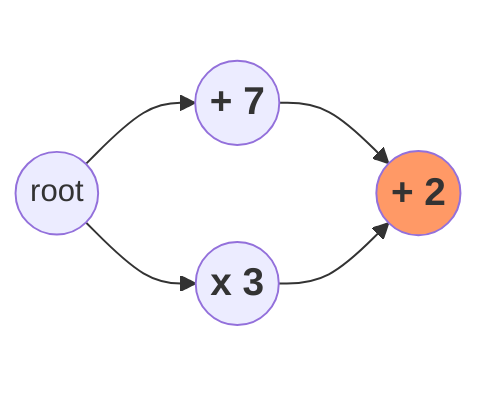

# Conflict

Conflict resolution is key to DRP's real time capability.

## What is a conflict?
The state of a [DRP program](./drp-program.md) can be affected by [concurrent](./concurrency.md) operations.

If applying these operations in any possible order produces the same program state, we do not have to worry about **conflicts**. If not, we are in conflict territory.

Consider a simple DRP program that:
- has a single number as its state
- accepts two types of operations: addition & multiplication

If its initial state is 1, and we have the following hashgraph (root vertex doesn't do anything i.e. it contains a null operation), what is the program state after applying the operations in the graph?



Different execution orders yield different results:
- \cdot3+2=26)
- +7+2=12)

Why?

The root cause is that these operations do not commute. When they happen concurrently, a **conflict** occurs.

It is important that we describe the program's behavior in case of conflicts. Every user in the same DRP program would follow the same behavior so they all reach the same resulting state.

This behavioral description is also called [concurrency semantics](https://en.wikipedia.org/wiki/Concurrency_semantics).

## Resolving conflicts

We need to set rules for how to handle conflicts. These rules are to be followed by every honest user of a DRP program. We call them **conflict resolution rules**.

In resolving a conflict, some of the operations involved might be dropped, while the rest of them are ordered in a deterministic manner.

Recall the example above, where addition and multiplication constitute a conflict. We could define its conflict resolution as "Multiplication First":
```
When in conflict, Multiplication is always ordered before Addition.
```

This way, any honest node following this rule would arrive at 12 as the final program state.

## Analogy

Imagine a DRP program that is a [pile of sand](https://blog.topology.gg/the-origins-of-topology-from-ledgers-to-sandcastles-part-2/).

We have Alice and Bob, starting from an identical pile.

Alice flattens the pile, while at the same time Bob molds it into a sphere. These operations are conflicting, so what do we do?

A valid rule to resolve this conflict would be "mold first". Molding happens before flattening.

Following the same rule, both Alice and Bob arrive at an identical sand disk.

## Further Reading
- [When to use a CRDT-based database](https://www.infoworld.com/article/2256888/when-to-use-a-crdt-based-database.html)
- [crdt.tech](https://crdt.tech/)

---

Page last updated: January 3, 2025
