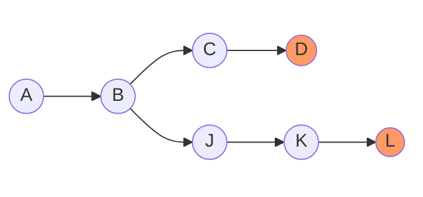
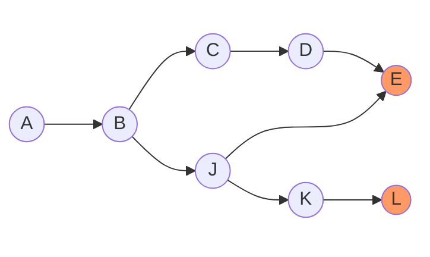
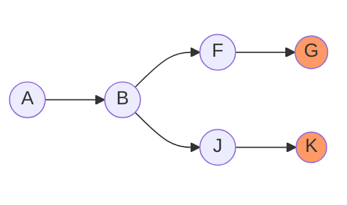
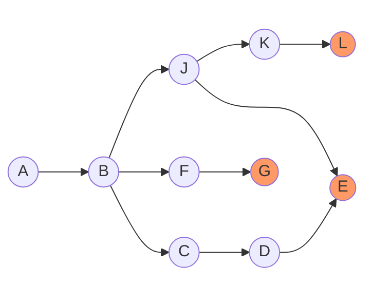

# Hashgraph

**Hashgraph** is the data structure underlying every DRP program.

## Purpose

Hashgraph serves as the *operation log* of a DRP program. It records:
- the operations occurred
- the causal relationship among them.
An operation is an update (write) on the program state.

Every user in a DRP program keeps a copy (replica) of the program's hashgraph. The client application running on the user's machine:
- reads this hashgraph for the state of the DRP program;
- writes to the DRP program by adding new operations to its hashgraph.

## Structure

Hashgraph is a *directed acyclic graph* (DAG), where:
- Vertices contain both the operations and the hashes of the vertices they causally depend on. Formally, each vertex *v* can be defined as a tuple *v = (u, D)*:
    - *u* is an update operation
    - *D* is the set of hashed vertices that are *v*'s causal dependencies
- Edges represent causal dependencies among the operations

**Frontier** is the set of vertices that has no children. They are the ones most recently added.

## Example

A hasgraph may look like this:

We notice:
- Orange vertices are the frontier: `{D, L}`
- A = (`some operation`, `{}`)
- B = (`some operation`, `{hash(A)}`)
- C = (`some operation`, `{hash(B)}`) ...

Now we add a new vertex E, which happens to depend on both D and J:

We notice:
- The frontier became `{E, L}`
- E = (`some operation`, `{hash(D), hash(J)}`)

## Merging

Picture Alice and Bob in the same DRP program. Each of them has a copy of the program's hashgraph. Each of them is updating their own copy locally.

When Alice and Bob synchronize with each other, their hashgraphs are **merged**. In math language, the merging of two hashgraphs is their union.

For example, merging:

and

yields

---

Page last updated: January 2, 2025
