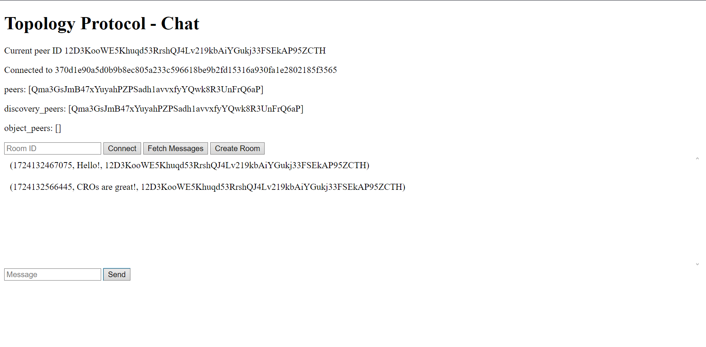

# Chat

## What we'll be building



--- 

## Table of contents
   
- [Chat](#chat)
	- [What we'll be building](#what-well-be-building)
	- [Table of contents](#table-of-contents)
	- [Overview](#overview)
	- [Scaffolding and configuration](#scaffolding-and-configuration)
	- [Designing the CRO](#designing-the-cro)
	- [Chat object](#chat-object)
	- [Basic HTML structure](#basic-html-structure)
	- [Driver code](#driver-code)
	- [Handlers](#handlers)
	- [Sending messages](#sending-messages)
	- [Displaying messages](#displaying-messages)
	- [Building and running the application](#building-and-running-the-application)
	- [Code reference](#code-reference)

## Overview

In this tutorial, we will build a simple chat application using a [CRO](../get-started/cro.md) from scratch. The users will be able to create a new chat room and send messages, as well as connect to an existing chat room and fetch the messages that have already been sent.

## Scaffolding and configuration

For this project, I am going to use vanilla typescript, `pnpm` for package management and `vite` for bundling the modules. This project can be adjusted to use a framework, like `React` or `Vue`. 

Let's start by scaffolding an application. 
If you haven't used `pnpm` yet, you can install it and scaffold the project with:

```bash
npm install -g pnpm;
pnpm create vite@latest chat --template vanilla-ts
```

Now, let's add the `topology-foundation` core packages.

```bash
cd chat;
pnpm install @topology-foundation/object @topology-foundation/node
```

In order to make sure that the dependencies build successfully we will also need `vite polyfills`.

```bash
pnpm i -D vite-plugin-node-polyfills
```

Then, we need to configure `vite` with `vite.config.mts` put at the root directory:

```ts
import { defineConfig } from "vite";
import { nodePolyfills } from "vite-plugin-node-polyfills";

export default defineConfig({
  build: {
    target: "esnext",
  },
  plugins: [nodePolyfills()],
  optimizeDeps: {
    esbuildOptions: {
      target: "esnext",
    },
  },
});
```

Last step before we start coding is to remove auto-generated files that we don't need.

```bash
rm src/counter.ts src/style.css src/typescript.svg src/vite-env.d.ts src/main.ts public/vite.svg; rmdir public
```

## Designing the CRO

When getting onto building with CROs, it is crucial to figure out the structure of the desired CRO, which depends on the data that is going to be handled. Every message includes the sender information, the timestamp, and the content. This data can be serialised into a single string. Now, we have to decide how the messages are going to be stored. The simplest way to store all messages in a chat room is a `set<string>`.

## Chat object

For this example, we are going to use a Set of type `string`. Let’s implement the `Chat` class, which implements the CRO class inside `src/objects/chat.ts`. We start defining the class of the object with all needed attributes. 

```ts
export class Chat implements CRO {
	operations: string[] = ["addMessage"];
	semanticsType: SemanticsType = SemanticsType.pair;
	messages: Set<string>;

```

And then we implement those functions:

- The constructor, which just assigns an empty set to `messages`

```ts
constructor() {
	this.messages = new Set<string>();
}
```

- `_addMessage()`, that adds a new message with additional data to the set of messages

```ts
private _addMessage(timestamp: string, message: string, nodeId: string): void {
    this.messages.add(`(${timestamp}, ${message}, ${nodeId})`);
}
```

- `getMessages()`, that returns the set of messages

```ts
getMessages(): Set<string> {
	return this.messages;
}
```

- `resolveConflicts()`, that is required when inheriting from `CRO`, but in this case, we do not have to worry about conflicts, so we can just return an empty action

```ts
resolveConflicts(vertices: Vertex[]): ResolveConflictsType {
	return { action: ActionType.Nop };
}
```

- `mergeCallback()`, which is called after a notification from the node that the object has been updated. We have to apply the operations to get the up-to-date state of the object 

```ts
mergeCallback(operations: Operation[]): void {
	for (const op of operations) {
		const args = op.value as string[];
		this._addMessage(args[0], args[1], args[2]);
	}
}
```

## Basic HTML structure

Having the structure of our CRO implemented, we can create a bare-bones HTML layout defining the main page. It will display the current peer ID, the CRO being connected to, the object peers, an input for the chat room ID and a few buttons to operate. We put it in `index.html`. [Code used](https://github.com/topology-foundation/ts-topology/blob/main/examples/chat/index.html).

## Driver code

Now we can start writing the main `src/index.ts` file, that is going to run our application. We commence by defining the global variables. 

```ts
const node = new TopologyNode();
let topologyObject: TopologyObject;
let chatCRO: Chat;
let peers: string[] = [];
let discoveryPeers: string[] = [];
let objectPeers: string[] = [];
```

We define `node` as a new TopologyNode, which is a peer in a network that can be connected to other nodes and exchange messages with them. `chatCRO` is an instance of the chat class that we created earlier. Then we define empty arrays that will be used to store, in order, all peers connected to the network, all peers that are in the `topology::discovery` pub/sub group, and peers that are connected to the same object as the current peer.

Let’s start writing the driver code of the application, where we establish the TopologyNode, add a custom message handler to it and define the behaviour for all buttons. 

```ts
async function main() {
    await node.start();
    render();
    ...
}
```

Firstly, we start the `node` (global variable). In doing so, the peer is created and assigned an ID, so we want to display that ID to the user. To keep things tidy, we will create a separate function to reflect the changes in the page, call it `render()`. We locate the elements from the HTML and fill in the information from the global variables.

```ts
const render = () => {
    const element_peerId = <HTMLDivElement>document.getElementById("peerId");
	element_peerId.innerHTML = node.networkNode.peerId;

	const element_peers = <HTMLDivElement>document.getElementById("peers");
	element_peers.innerHTML = `[${peers.join(", ")}]`;

	const element_discoveryPeers = <HTMLDivElement>(document.getElementById("discoveryPeers"));
	element_discoveryPeers.innerHTML = `[${discoveryPeers.join(", ")}]`;

	const element_objectPeers = <HTMLDivElement>(document.getElementById("objectPeers"));
	element_objectPeers.innerHTML = `[${objectPeers.join(", ")}]`;
}
```

## Handlers

We need to define a few handlers for our `node`. First of all, a generic message handler. It is a generic `customGroupMessageHandler` because we are passing an empty string as the `group`. We update `peers`, `discoveryPeers` and reflect the changes.

```ts
node.addCustomGroupMessageHandler("", (e) => {
	peers = node.networkNode.getAllPeers();
	discoveryPeers = node.networkNode.getGroupPeers("topology::discovery");
	render();
});
```

Now let's implement the logic for creating a `TopologyObject` and connecting to one. When creating, we are passing a new `Chat` object, which is a CRO, and assign the global `chatCRO` variable.

```ts
button_create.addEventListener("click", async () => {
	topologyObject = await node.createObject(new Chat());
	chatCRO = topologyObject.cro as Chat;
	// TODO : createConnectHandlers();
	render();
});
``` 

When connecting to an existing `TopologyObject`, we are essencially copying the object we want to connect to by creating a new object and syncing by passing its `objectId` and passing `sync` ans `true`. 

```ts
button_connect.addEventListener("click", async () => {
	const input: HTMLInputElement = <HTMLInputElement>(
		document.getElementById("roomInput")
	);
	const objectId = input.value;

	topologyObject = await node.createObject(
		new Chat(),
		objectId,
		undefined,
		true,
	);
	chatCRO = topologyObject.cro as Chat;
	// TODO: createConnectHandlers();
	render();
});
```

The `createConnectHandlers()` needs to set up the `node` to receive messages of the `topologyObject`'s pub/sub group. The object stored inside the `node` also needs to subscribe to the object that the user is creating/connecting to.

```ts
async function createConnectHandlers() {
	node.addCustomGroupMessageHandler(topologyObject.id, (e) => {
		if (topologyObject) objectPeers = node.networkNode.getGroupPeers(topologyObject.id);
		render();
	});

	node.objectStore.subscribe(topologyObject.id, (_, _obj) => {
		render();
	});
}
```

## Sending messages

Sending messages is as easy as calling the `addMessage` function of the CRO. We need to check if the CRO is initialised, and if not, alert the user.

```ts
async function sendMessage(message: string) {
	const timestamp: string = Date.now().toString();
	if (!chatCRO) {
		console.error("Chat CRO not initialized");
		alert("Please create or join a chat room first");
		return;
	}

	chatCRO.addMessage(timestamp, message, node.networkNode.peerId);
	render();
}
```

Then we can assign the logic to a button.

```ts
button_send.addEventListener("click", async () => {
	const input: HTMLInputElement = <HTMLInputElement>(
		document.getElementById("messageInput")
	);
	const message: string = input.value;
	input.value = "";
	if (!message) {
		console.error("Tried sending an empty message");
		alert("Please enter a message");
		return;
	}
	await sendMessage(message);
});
```

## Displaying messages

Let's update the `render()` function to display the current state of the CRO.

```ts
// If the peer is not connected to a chat room, nothing to display
if (!chatCRO) return;
const chat = chatCRO.getMessages();
const element_chat = <HTMLDivElement>document.getElementById("chat");
element_chat.innerHTML = "";

if (chat.size === 0) {
	const div = document.createElement("div");
	div.innerHTML = "No messages yet";
	div.style.padding = "10px";
	element_chat.appendChild(div);
	return;
}

// Message structure is (${timestamp}, ${message}, ${senderId})
// Sorting will yield the correct order by timestamp
for (const message of [...chat].sort()) {
	const div = document.createElement("div");
	div.innerHTML = message;
	div.style.padding = "10px";
	element_chat.appendChild(div);
}
```

And the last thing to do is to call the `main()` function at the end of the file.

The application is ready! The user can create a new chat room, connect to an existing one, send messages, and browse though messages that have been sent.

## Building and running the application

To build and run the application locally, you can set up scripts in `package.json` like this.

```json
"scripts": {
	"build": "vite build",
	"clean": "rm -rf dist/ node_modules/",
	"dev": "vite serve"
},
```

Then, navigate to the parent directory of your project and run the following commands.

```bash
pnpm build;
pnpm dev
```

## Code reference

The full code can be found under [ts-topology/examples/chat](https://github.com/topology-foundation/ts-topology/tree/main/examples/chat).