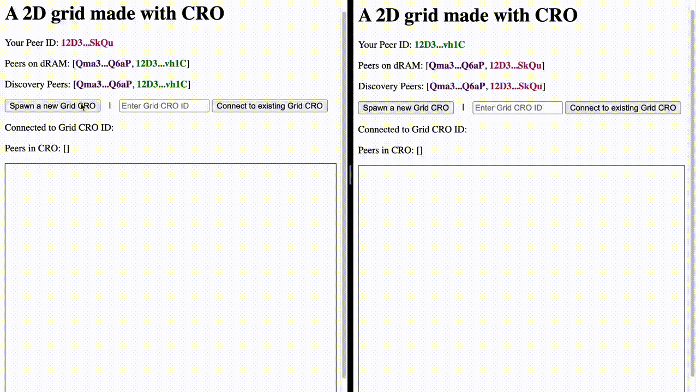
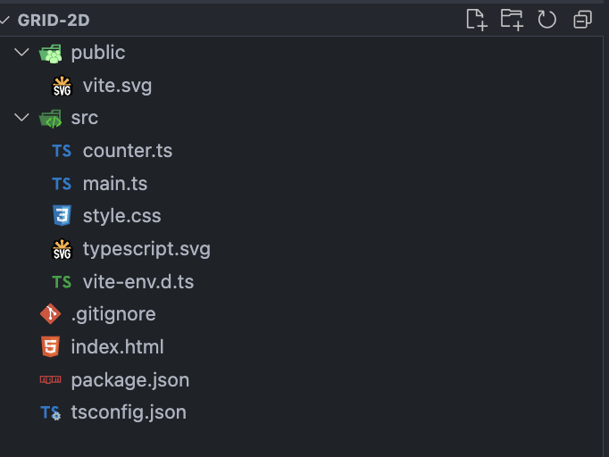
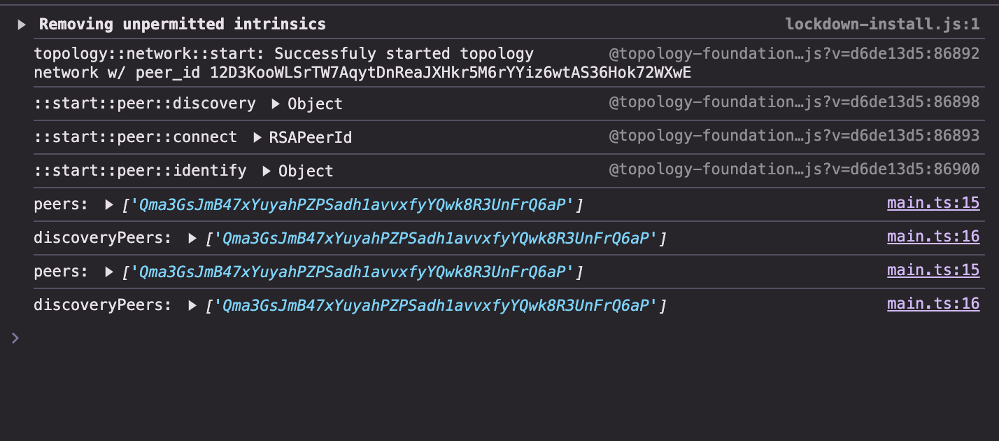
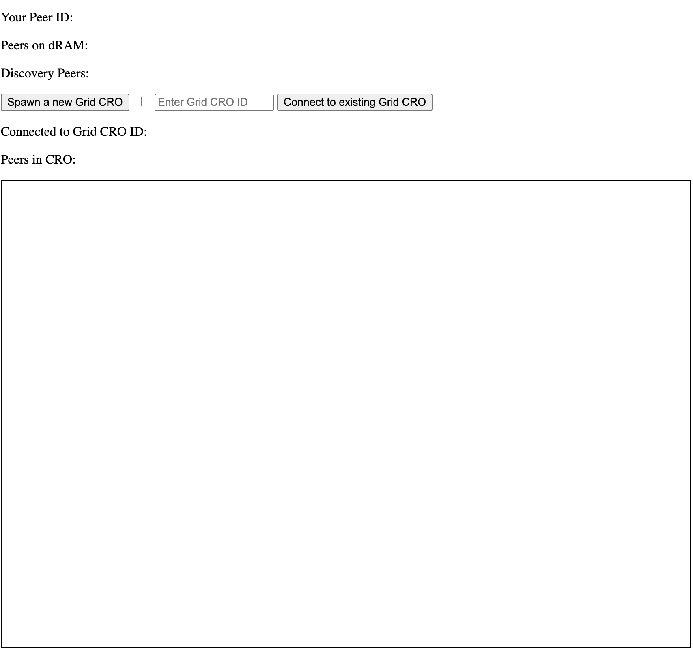

# Grid

A simple multiplayer 2D Grid where players can move on the grid one space at a time.

## What you'll be building?

We'll build a 2D Grid space using topology where users appears to be circle on a grid and can move around one space at a time.

Our end result should look something like this:



## Setup for the tutorial

First we'll have to setup our dev environment. I'll be using vite here with typescript.

```bash
npm create vite@latest grid-2d -- --template vanilla-ts
```

This should create a simple typescript project with typescript. You should see a project structure similar to what's shown below.



> Note: While we're using vanilla TypeScript here, you could adapt this tutorial to work with frameworks like React or Vue!

Now, let's get the dependencies we need for building a CRO and connecting to the topology network.

```bash
npm i @topology-foundation/object @topology-foundation/node
```

In order to make sure that the dependency would build successfully we will also need some changes to the vite configurations.

```bash
npm i -D vite-plugin-node-polyfills
```

And then add a new file called `vite.config.mts` at the root of the application, with the following content.

```ts
import { defineConfig } from "vite";
import { nodePolyfills } from "vite-plugin-node-polyfills";

export default defineConfig({
  build: {
    target: "esnext",
  },
  plugins: [nodePolyfills()],
  optimizeDeps: {
    esbuildOptions: {
      target: "esnext",
    },
  },
});
```

Let's remove some files in the projects that we don't need. Remove `src/counter.ts`, `src/style.css` and `src/typescript.svg`, and delete the contents of `src/main.ts`.

With that, you should have most if not all of what we need for this project!

## Building the Grid logic

First off, let's try to define clearly what we want to build.

- 2D grid
- Users can move one space at a time on the grid
- Movement is possible in four directions: `UP`, `DOWN`, `LEFT`, and `RIGHT`
- Multiple users should be able to interact with the grid

With this idea in mind, let's start with a basic object-oriented approach. Create a new file at `src/grid.ts` and with the below code:

```ts
export class Grid {
  positions: Map<string, { x: number; y: number }>;

  constructor() {
    this.positions = new Map<string, { x: number; y: number }>();
  }

  addUser(userId: string) {
    // User all start at 0,0
    this.positions.set(userId, { x: 0, y: 0 });
  }

  moveUser(userId: string, direction: "UP" | "DOWN" | "LEFT" | "RIGHT") {
    // Check if user exist
    const user = [...this.positions.keys()].find((u) => u === userId);

    if (user) {
      const currentPos = this.getUserPosition(userId);
      if (currentPos) {
        switch (direction) {
          case "UP":
            currentPos.y += 1;
            break;
          case "DOWN":
            currentPos.y -= 1;
            break;
          case "LEFT":
            currentPos.x -= 1;
            break;
          case "RIGHT":
            currentPos.x += 1;
            break;
        }
      }
    }
  }

  getUsers() {
    // Get all users on the grid
    return [...this.positions.keys()];
  }

  getUserPosition(userId: string) {
    // Get where user are on the grid.
    const currentPos = this.positions.get(userId);
    return currentPos ? currentPos : undefined;
  }
}
```

The above definition should be quite straightforward; the Grid can add user, move user, and get some information regarding the user. We can define the position of the user on the Grid as (x,y) coordinate as well.

Now, let's turn this into a `CRO`!

## Implementing the CRO interface.

To build a CRO, we'll have to implement the `CRO` interface.

```ts
import { CRO } from "@topology-foundation/object";

export class Grid implements CRO {
  // ... code ...
```

When you add this interface, TypeScript will show errors indicating that we haven't fully implemented the `CRO` interface. Let's examine the CRO interface:

```ts
export interface CRO {
  operations: string[];
  semanticsType: SemanticsType;
  resolveConflicts: (vertices: Vertex[]) => ResolveConflictsType;
  mergeCallback: (operations: Operation[]) => void;
}
```

Let's walk over the details of the interface:

- `operations`: Defines the allowed state-changing actions, in our case, `addUser` and `moveUser`
- `semanticsType`: Determines the concurrency semantics of the `CRO`, either handling operations pairwise (`SematicType.pair`) or in groups (`SematicType.multiple`).
- `resolveConflicts`: Specifies how to handle conflicting operations
- `mergeCallback`: Defines how to apply operations to update the local state

Let's add in the implementation! First add the required fields:

```ts
export class Grid {
  positions: Map<string, { x: number; y: number }>;
  operations: string[] = ["addUser", "moveUser"];
  semanticsType: SemanticsType = SemanticsType.pair

  constructor() {
    this.positions = new Map<string, { x: number; y: number }>();
  }

//   ... more code ..
```

Now let's add in the methods:

```ts
  addUser(userId: string) {
    this._addUser(userId);
  }

  moveUser(userId: string, direction: "UP" | "DOWN" | "LEFT" | "RIGHT") {
    this._moveUser(userId, direction);
  }

  _addUser(userId: string) {
    // User all start at 0,0
    this.positions.set(userId, { x: 0, y: 0 });
  }

  _moveUser(userId: string, direction: "UP" | "DOWN" | "LEFT" | "RIGHT") {
    // Check if user exist
    const user = [...this.positions.keys()].find((u) => u === userId);

    if (user) {
      const currentPos = this.getUserPosition(userId);
      if (currentPos) {
        switch (direction) {
          case "UP":
            currentPos.y += 1;
            break;
          case "DOWN":
            currentPos.y -= 1;
            break;
          case "LEFT":
            currentPos.x -= 1;
            break;
          case "RIGHT":
            currentPos.x += 1;
            break;
        }
      }
    }
  }

	resolveConflicts(vertices: Vertex[]): ResolveConflictsType {
		return { action: ActionType.Nop };
	}

	mergeCallback(operations: Operation[]): void {
		// reset this.positions
		this.positions = new Map<string, { x: number; y: number }>();

		// apply operations to this.positions
		for (const op of operations) {
			if (!op.value) continue;
			switch (op.type) {
				case "addUser": {
					const [userId] = op.value;
					this._addUser(userId);
					break;
				}
				case "moveUser": {
					const [userId, direction] = op.value;
					this._moveUser(userId, direction);
					break;
				}
			}
		}
	}
```

Here, the `mergeCallback` method will update the positions the user have locally on their machine to based on the operation received.

Notice that we created additional methods `_addUser` and `_moveUser` and moved from the original methods into them.
This is because we had define `addUser` and `moveUser` as operations and calling them will add new vertices to the underlying hashgraph,
which we do not want to happen when `mergeCallback` is called.

We implement `resolveConflicts` to simply return `ActionType.Nop` which tells the `CRO` not to do anything when a conflict is detected. This is done as we expect each user to only be able to move themselves.

Since we want to easily tell users apart, let's add some color to each user based on their user id.

```ts
  // ... other methods ...

  addUser(userId: string, color: string) {
    this._addUser(userId: string, color: string);
  }

  _addUser(userId: string, color: string) {
    const userColorString = `${userId}:${color}`;
    // User all start at 0,0
    // Encode the color as part of the new id
    this.positions.set(userColorString, { x: 0, y: 0 });
  }

  _moveUser(userId: string, direction: "UP" | "DOWN" | "LEFT" | "RIGHT") {
    // Check if user exist
    const userColorString = [...this.positions.keys()].find((u) =>
		u.startsWith(`${userId}:`),
	);

    if (userColorString) {
      const currentPos = this.getUserPosition(userColorString);
      if (currentPos) {
        switch (direction) {
          case "UP":
            currentPos.y += 1;
            break;
          case "DOWN":
            currentPos.y -= 1;
            break;
          case "LEFT":
            currentPos.x -= 1;
            break;
          case "RIGHT":
            currentPos.x += 1;
            break;
       	}
      }
    }
  }

  // ... other methods ...

  getUserPosition(userColorString: string) {
    // Get where user are on the grid.
    const currentPos = this.positions.get(userColorString);
    return currentPos ? currentPos : undefined;
  }

  mergeCallback(operations: Operation[]): void {
		// reset this.positions
		this.positions = new Map<string, { x: number; y: number }>();

		// apply operations to this.positions
		for (const op of operations) {
			if (!op.value) continue;
			switch (op.type) {
				case "addUser": {
					const [userId, color] = op.value; // color added here
					this._addUser(userId, color);
					break;
				}
				case "moveUser": {
					const [userId, direction] = op.value;
					this._moveUser(userId, direction);
					break;
				}
			}
		}
	}
  // ... other methods ...
```

Your `CRO` should look something like this at the end:

```ts
import {
  ActionType,
  type CRO,
  type Operation,
  type ResolveConflictsType,
  SemanticsType,
  type Vertex,
} from "@topology-foundation/object";

export class Grid implements CRO {
  positions: Map<string, { x: number; y: number }>;
  operations: string[] = ["addUser", "moveUser"];
  semanticsType: SemanticsType = SemanticsType.pair;

  constructor() {
    this.positions = new Map<string, { x: number; y: number }>();
  }

  addUser(userId: string, color: string) {
    this._addUser(userId: string, color: string);
  }

  moveUser(userId: string, direction: "UP" | "DOWN" | "LEFT" | "RIGHT") {
    this._moveUser(userId, direction);
  }

  _addUser(userId: string, color: string) {
    const userColorString = `${userId}:${color}`;
    // User all start at 0,0
    // Encode the color as part of the new id
    this.positions.set(userColorString, { x: 0, y: 0 });
  }

  _moveUser(userId: string, direction: "UP" | "DOWN" | "LEFT" | "RIGHT") {
    // Check if user exist
    const userColorString = [...this.positions.keys()].find((u) =>
      u.startsWith(`${userId}:`)
    );

    if (userColorString) {
      const currentPos = this.getUserPosition(userColorString);
      if (currentPos) {
        switch (direction) {
          case "UP":
            currentPos.y += 1;
            break;
          case "DOWN":
            currentPos.y -= 1;
            break;
          case "LEFT":
            currentPos.x -= 1;
            break;
          case "RIGHT":
            currentPos.x += 1;
            break;
        }
      }
    }
  }

  getUsers() {
    // Get all users on the grid
    return [...this.positions.keys()];
  }

  getUserPosition(userColorString: string) {
    // Get where user are on the grid.
    const currentPos = this.positions.get(userColorString);
    return currentPos ? currentPos : undefined;
  }

  resolveConflicts(vertices: Vertex[]): ResolveConflictsType {
    return { action: ActionType.Drop };
  }

  mergeCallback(operations: Operation[]): void {
    // reset this.positions
    this.positions = new Map<string, { x: number; y: number }>();

    // apply operations to this.positions
    for (const op of operations) {
      if (!op.value) continue;
      switch (op.type) {
        case "addUser": {
          const [userId, color] = op.value;
          this._addUser(userId, color);
          break;
        }
        case "moveUser": {
          const [userId, direction] = op.value;
          this._moveUser(userId, direction);
          break;
        }
      }
    }
  }
}
```

## Setting up our topology node

With our Grid CRO implemented, let's now start to setup the topology node and connect to the network. Open your `src/main.ts` file and add this in:

```ts
import { TopologyNode } from "@topology-foundation/node";
import type { TopologyObject } from "@topology-foundation/object";

const node = new TopologyNode();
let topologyObject: TopologyObject;

async function main() {
  await node.start();

  node.addCustomGroupMessageHandler("", (e) => {
    const peers = node.networkNode.getAllPeers();
    const discoveryPeers = node.networkNode.getGroupPeers(
      "topology::discovery"
    );
    console.log("peers:", peers);
    console.log("discoveryPeers:", discoveryPeers);
  });
}

main();
```

What we essentially are doing here is initialize and start a `TopologyNode` and then add a group message handler to it, which listens to broadcasted messages by its peers, and then when message is received, get all the `peers`, which are all the nodes that our current node has connection to, and `discoveryPeers`, which are the nodes that is interested in the `topology:discovery` topic.

Now we can start the application:

```bash
npm run dev
```

Go to `http://localhost:5173` and you should see something like this in the developer console.



Congratulations! You now have a running topology node!

## Building the Grid UI

Now let's get some visualization up and running! Remember, what we need is a simple **2D grid that allows users to move one space at a time**. Let's open the `index.html` file and start to add some UI components to it.

Replace the current content in the file with the code below:

```html
<!DOCTYPE html>
<html lang="en">
  <head>
    <meta charset="UTF-8" />
    <meta name="viewport" content="width=device-width, initial-scale=1.0" />
    <!-- Change the title here -->
    <title>Topology - Grid</title>
  </head>
  <body>
    <div>
      <p>Your Peer ID: <span id="peerId"></span></p>
      <p>Peers on dRAM: <span id="peers"></span></p>
      <p>Discovery Peers: <span id="discoveryPeers"></span></p>

      <button id="createGrid">Spawn a new Grid CRO</button>
      <span style="margin: 0 10px;">|</span>
      <input id="gridInput" type="text" placeholder="Enter Grid CRO ID" />
      <button id="joinGrid">Connect to existing Grid CRO</button>
      <p>
        Connected to Grid CRO ID:
        <span id="gridId" style="text-decoration: underline;"></span>
        <button id="copyGridId" style="margin-left: 10px; display: none;">
          Copy
        </button>
      </p>
      <p>Peers in CRO: <span id="objectPeers"></span></p>
    </div>

    <div
      id="grid"
      style="
        position: relative;
        width: 100%;
        height: 60vh;
        border: 1px solid black;
        overflow: hidden;
      "
    >
      <!-- Users will appear here -->
    </div>

    <script type="module" src="/src/main.ts"></script>
  </body>
</html>
```

We are displaying a few things through this UI:

1. Our peer id.
2. The peers of our node.
3. The peers that subscribe to the `topology:discovery` topic.
4. Grid CRO id
5. Button to generate a new CRO
6. Button to connect to a CRO
7. The grid where the users will appear
8. Peers who are interacting with the CRO

It should look something like this when you do `npm run dev`:



## Adding the UI rendering logic

Before we dive into the core of the application, let's define some helper function at a new file `src/utils.ts` that we'll use later.

```ts
export const hexToRgbaString = (hex: string, alpha: number): string => {
  const bigint = Number.parseInt(hex.slice(1), 16);
  const r = (bigint >> 16) & 255;
  const g = (bigint >> 8) & 255;
  const b = bigint & 255;
  return `rgba(${r}, ${g}, ${b}, ${alpha})`;
};

export const rgbToHexString = (r: number, g: number, b: number): string => {
  return `#${((1 << 24) + (r << 16) + (g << 8) + b).toString(16).slice(1)}`;
};

export const formatNodeId = (id: string): string => {
  return `${id.slice(0, 4)}...${id.slice(-4)}`;
};

export const hashCode = (str: string): number => {
  let hash = 0;
  for (let i = 0; i < str.length; i++) {
    hash = (hash << 5) - hash + str.charCodeAt(i);
    hash |= 0; // Convert to 32bit integer
  }
  return hash;
};
```

- `hexToRgbaString` and `rgbToHexString` is for us to convert between hex and rgb mode
- `formatNodeId` basically shortens the node id to a shorter form like `123...321`
- `hashCode` hashes some string (in this case we are actually passing in the node id) into a 32 bit integer so that we can utilize it to generate our rgb color.

With these utils ready, now we can start working on `src/main.ts`.

Let's add variables that we want to display on our UI.

```ts
import { TopologyNode } from "@topology-foundation/node";
import type { TopologyObject } from "@topology-foundation/object";
import { Grid } from "./grid"; // import this

const node = new TopologyNode();
let topologyObject: TopologyObject;

// Add these variables
let gridCRO: Grid;
let peers: string[] = [];
let discoveryPeers: string[] = [];
let objectPeers: string[] = [];
const colorMap: Map<string, string> = new Map(); // Cache id color mapping

/// ... more code ...
```

Let's also add a function to generate a color from the node id.

```ts
// ... more imports ...
import {
  formatNodeId,
  hashCode,
  hexToRgbaString,
  rgbToHexString,
} from "./utils"; // Import this

// ... more code ...

const colorMap: Map<string, string> = new Map(); // Cache id color mapping

// Add this function
const getColorForNodeId = (id: string): string => {
  if (!colorMap.has(id)) {
    const hash = hashCode(id);
    const r = (hash & 0xff0000) >> 16;
    const g = (hash & 0x00ff00) >> 8;
    const b = hash & 0x0000ff;

    const color = rgbToHexString(r, g, b); // Convert RGB to hex
    colorMap.set(id, color);
  }
  return colorMap.get(id) || "#000000";
};

// ... more code ...
```

Now onto to core of this application, the `render` function which will render all our information on the UI. The `render` function will be ran every time there are new updates to the state.

```ts
// ... more code ...
	return colorMap.get(id) || "#000000";
};

const render = () => {
	if (topologyObject) {
		const gridIdElement = <HTMLSpanElement>document.getElementById("gridId");
		gridIdElement.innerText = topologyObject.id;
		const copyGridIdButton = document.getElementById("copyGridId");
		if (copyGridIdButton) {
			copyGridIdButton.style.display = "inline"; // Show the button
		}
	} else {
		const copyGridIdButton = document.getElementById("copyGridId");
		if (copyGridIdButton) {
			copyGridIdButton.style.display = "none"; // Hide the button
		}
	}

	const elementPeerId = <HTMLDivElement>document.getElementById("peerId");
	elementPeerId.innerHTML = `<strong style="color: ${getColorForNodeId(node.networkNode.peerId)};">${formatNodeId(node.networkNode.peerId)}</strong>`;

	const elementPeers = <HTMLDivElement>document.getElementById("peers");
	elementPeers.innerHTML = `[${peers.map((peer) => `<strong style="color: ${getColorForNodeId(peer)};">${formatNodeId(peer)}</strong>`).join(", ")}]`;

	const elementDiscoveryPeers = <HTMLDivElement>(
		document.getElementById("discoveryPeers")
	);
	elementDiscoveryPeers.innerHTML = `[${discoveryPeers.map((peer) => `<strong style="color: ${getColorForNodeId(peer)};">${formatNodeId(peer)}</strong>`).join(", ")}]`;

	const elementObjectPeers = <HTMLDivElement>(
		document.getElementById("objectPeers")
	);
	elementObjectPeers.innerHTML = `[${objectPeers.map((peer) => `<strong style="color: ${getColorForNodeId(peer)};">${formatNodeId(peer)}</strong>`).join(", ")}]`;

	if (!gridCRO) return;
	const users = gridCRO.getUsers();
	const elementGrid = <HTMLDivElement>document.getElementById("grid");
	elementGrid.innerHTML = "";

	const gridWidth = elementGrid.clientWidth;
	const gridHeight = elementGrid.clientHeight;
	const centerX = Math.floor(gridWidth / 2);
	const centerY = Math.floor(gridHeight / 2);

	// Draw grid lines
	const numLinesX = Math.floor(gridWidth / 50);
	const numLinesY = Math.floor(gridHeight / 50);

	for (let i = -numLinesX; i <= numLinesX; i++) {
		const line = document.createElement("div");
		line.style.position = "absolute";
		line.style.left = `${centerX + i * 50}px`;
		line.style.top = "0";
		line.style.width = "1px";
		line.style.height = "100%";
		line.style.backgroundColor = "lightgray";
		elementGrid.appendChild(line);
	}

	for (let i = -numLinesY; i <= numLinesY; i++) {
		const line = document.createElement("div");
		line.style.position = "absolute";
		line.style.left = "0";
		line.style.top = `${centerY + i * 50}px`;
		line.style.width = "100%";
		line.style.height = "1px";
		line.style.backgroundColor = "lightgray";
		elementGrid.appendChild(line);
	}

	for (const userColorString of users) {
		const [id, color] = userColorString.split(":");
		const position = gridCRO.getUserPosition(userColorString);

		if (position) {
			const div = document.createElement("div");
			div.style.position = "absolute";
			div.style.left = `${centerX + position.x * 50 + 5}px`; // Center the circle
			div.style.top = `${centerY - position.y * 50 + 5}px`; // Center the circle
			if (id === node.networkNode.peerId) {
				div.style.width = `${34}px`;
				div.style.height = `${34}px`;
			} else {
				div.style.width = `${34 + 6}px`;
				div.style.height = `${34 + 6}px`;
			}
			div.style.backgroundColor = color;
			div.style.borderRadius = "50%";
			div.style.transition = "background-color 1s ease-in-out";
			div.style.animation = `glow-${id} 0.5s infinite alternate`;

			// Add black border for the current user's circle
			if (id === node.networkNode.peerId) {
				div.style.border = "3px solid black";
			}

			// Create dynamic keyframes for the glow effect
			const style = document.createElement("style");
			style.innerHTML = `
			@keyframes glow-${id} {
				0% {
					background-color: ${hexToRgbaString(color, 0.5)};
				}
				100% {
					background-color: ${hexToRgbaString(color, 1)};
				}
			}`;
			document.head.appendChild(style);

			elementGrid.appendChild(div);
		}
	}
};

// ... more code ...
```

Let's go through this rendering code step by step.

First this section:

```ts
if (topologyObject) {
  const gridIdElement = <HTMLSpanElement>document.getElementById("gridId");
  gridIdElement.innerText = topologyObject.id;
  const copyGridIdButton = document.getElementById("copyGridId");
  if (copyGridIdButton) {
    copyGridIdButton.style.display = "inline"; // Show the button
  }
} else {
  const copyGridIdButton = document.getElementById("copyGridId");
  if (copyGridIdButton) {
    copyGridIdButton.style.display = "none"; // Hide the button
  }
}
```

This essentially checks if topologyObject is initialized and if it is then it'll render the Grid CRO id and also the button to copy the Grid CRO id.

```ts
const elementPeerId = <HTMLDivElement>document.getElementById("peerId");
elementPeerId.innerHTML = `<strong style="color: ${getColorForNodeId(
  node.networkNode.peerId
)};">${formatNodeId(node.networkNode.peerId)}</strong>`;

const elementPeers = <HTMLDivElement>document.getElementById("peers");
elementPeers.innerHTML = `[${peers
  .map(
    (peer) =>
      `<strong style="color: ${getColorForNodeId(peer)};">${formatNodeId(
        peer
      )}</strong>`
  )
  .join(", ")}]`;

const elementDiscoveryPeers = <HTMLDivElement>(
  document.getElementById("discoveryPeers")
);
elementDiscoveryPeers.innerHTML = `[${discoveryPeers
  .map(
    (peer) =>
      `<strong style="color: ${getColorForNodeId(peer)};">${formatNodeId(
        peer
      )}</strong>`
  )
  .join(", ")}]`;

const elementObjectPeers = <HTMLDivElement>(
  document.getElementById("objectPeers")
);
elementObjectPeers.innerHTML = `[${objectPeers
  .map(
    (peer) =>
      `<strong style="color: ${getColorForNodeId(peer)};">${formatNodeId(
        peer
      )}</strong>`
  )
  .join(", ")}]`;
```

Here, we are adding color to the string display of our peer id and other peer ids we are connected to so that we can later correlate their color with their position on the grid.

```ts
if (!gridCRO) return;
const users = gridCRO.getUsers();
const elementGrid = <HTMLDivElement>document.getElementById("grid");
elementGrid.innerHTML = "";

const gridWidth = elementGrid.clientWidth;
const gridHeight = elementGrid.clientHeight;
const centerX = Math.floor(gridWidth / 2);
const centerY = Math.floor(gridHeight / 2);

// Draw grid lines
const numLinesX = Math.floor(gridWidth / 50);
const numLinesY = Math.floor(gridHeight / 50);

for (let i = -numLinesX; i <= numLinesX; i++) {
  const line = document.createElement("div");
  line.style.position = "absolute";
  line.style.left = `${centerX + i * 50}px`;
  line.style.top = "0";
  line.style.width = "1px";
  line.style.height = "100%";
  line.style.backgroundColor = "lightgray";
  elementGrid.appendChild(line);
}

for (let i = -numLinesY; i <= numLinesY; i++) {
  const line = document.createElement("div");
  line.style.position = "absolute";
  line.style.left = "0";
  line.style.top = `${centerY + i * 50}px`;
  line.style.width = "100%";
  line.style.height = "1px";
  line.style.backgroundColor = "lightgray";
  elementGrid.appendChild(line);
}
```

This part of the code renders the grid on the UI display; It will only draw the lines for the grid when the Grid CRO is initialized and available.

```ts
for (const userColorString of users) {
  const [id, color] = userColorString.split(":");
  const position = gridCRO.getUserPosition(userColorString);

  if (position) {
    const div = document.createElement("div");
    div.style.position = "absolute";
    div.style.left = `${centerX + position.x * 50 + 5}px`; // Center the circle
    div.style.top = `${centerY - position.y * 50 + 5}px`; // Center the circle
    if (id === node.networkNode.peerId) {
      div.style.width = `${34}px`;
      div.style.height = `${34}px`;
    } else {
      div.style.width = `${34 + 6}px`;
      div.style.height = `${34 + 6}px`;
    }
    div.style.backgroundColor = color;
    div.style.borderRadius = "50%";
    div.style.transition = "background-color 1s ease-in-out";
    div.style.animation = `glow-${id} 0.5s infinite alternate`;

    // Add black border for the current user's circle
    if (id === node.networkNode.peerId) {
      div.style.border = "3px solid black";
    }

    // Create dynamic keyframes for the glow effect
    const style = document.createElement("style");
    style.innerHTML = `
			@keyframes glow-${id} {
				0% {
					background-color: ${hexToRgbaString(color, 0.5)};
				}
				100% {
					background-color: ${hexToRgbaString(color, 1)};
				}
			}`;
    document.head.appendChild(style);

    elementGrid.appendChild(div);
  }
}
```

Finally, this loop renders the users' position on the 2D grid. It loops through all the current `users` and get the `userId` and `color` from the `userColorString`. It then gets the user's position via `getUserPosition` and draws them in the grid. At the end of the code it also adds keyframes for a glow effect.

## Putting everything together

Let's connect the UI with our Grid CRO.

First, let's define some helper functions to add and move users. These functions include checks for Grid CRO initialization:

```ts
async function addUser() {
  if (!gridCRO) {
    console.error("Grid CRO not initialized");
    alert("Please create or join a grid first");
    return;
  }

  gridCRO.addUser(
    node.networkNode.peerId,
    getColorForNodeId(node.networkNode.peerId)
  );
  render();
}

async function moveUser(direction: "UP" | "DOWN" | "LEFT" | "RIGHT") {
  if (!gridCRO) {
    console.error("Grid CRO not initialized");
    alert("Please create or join a grid first");
    return;
  }

  gridCRO.moveUser(node.networkNode.peerId, direction);
  render();
}
```

Next, let's add a function that subscribes to our CRO's messages and triggers a re-render when new messages are received:

```ts
async function createConnectHandlers() {
  node.addCustomGroupMessageHandler(topologyObject.id, (e) => {
    if (topologyObject) {
      objectPeers = node.networkNode.getGroupPeers(topologyObject.id);
    }
    render();
  });

  node.objectStore.subscribe(topologyObject.id, (_, obj) => {
    render();
  });
}
```

Finally, add the following to our main function:

```ts
async function main() {
  await node.start();
  render();

  node.addCustomGroupMessageHandler("", (e) => {
    peers = node.networkNode.getAllPeers();
    discoveryPeers = node.networkNode.getGroupPeers("topology::discovery");
    render();
  });

  const buttonCreate = <HTMLButtonElement>document.getElementById("createGrid");
  buttonCreate.addEventListener("click", async () => {
    topologyObject = await node.createObject(new Grid());
    gridCRO = topologyObject.cro as Grid;
    createConnectHandlers();
    await addUser();
    render();
  });

  const buttonConnect = <HTMLButtonElement>document.getElementById("joinGrid");
  buttonConnect.addEventListener("click", async () => {
    const croId = (<HTMLInputElement>document.getElementById("gridInput"))
      .value;
    try {
      topologyObject = await node.createObject(
        new Grid(),
        croId,
        undefined,
        true
      );
      gridCRO = topologyObject.cro as Grid;
      createConnectHandlers();
      await addUser();
      render();
      console.log("Succeeded in connecting with CRO", croId);
    } catch (e) {
      console.error("Error while connecting with CRO", croId, e);
    }
  });

  document.addEventListener("keydown", (event) => {
    if (event.key === "w") moveUser("UP");
    if (event.key === "a") moveUser("LEFT");
    if (event.key === "s") moveUser("DOWN");
    if (event.key === "d") moveUser("RIGHT");
  });

  const copyButton = <HTMLButtonElement>document.getElementById("copyGridId");
  copyButton.addEventListener("click", () => {
    const gridIdText = (<HTMLSpanElement>document.getElementById("gridId"))
      .innerText;
    navigator.clipboard
      .writeText(gridIdText)
      .then(() => {
        console.log("Grid CRO ID copied to clipboard");
      })
      .catch((err) => {
        console.error("Failed to copy: ", err);
      });
  });
}
```

Let's examine each part of the code in detail:

```ts
await node.start();
render();

node.addCustomGroupMessageHandler("", (e) => {
  peers = node.networkNode.getAllPeers();
  discoveryPeers = node.networkNode.getGroupPeers("topology::discovery");
  render();
});
```

We are already familiar with `node.start()` which starts the topology node. The new addition here is the `render` call, which in this case will perform the initial UI rendering.

The `addCustomGroupMessageHandler` updates the `peers` and `discoveryPeers` global variables and triggers a re-render. This ensures that the UI updates whenever we receive messages about newly discovered peers, which in this case updates the `peers` and `discoveryPeers` displayed on the UI.

```ts
const buttonCreate = <HTMLButtonElement>document.getElementById("createGrid");
buttonCreate.addEventListener("click", async () => {
  topologyObject = await node.createObject(new Grid());
  gridCRO = topologyObject.cro as Grid;
  createConnectHandlers();
  await addUser();
  render();
});
```

When the create button is clicked, we:

1. `node.createObject(new Grid())`, which registers our Grid CRO with the topology node and propagate it to the network.
2. `createConnectHandlers()` which subscribes to the messages on the Grid CRO object
3. `addUser()` which adds us as one of the users on the Grid.
4. `render()` which will now render the Grid on the UI as both `topologyObject`, `gridCRO` and the user is now initialized.

```ts
const buttonConnect = <HTMLButtonElement>document.getElementById("joinGrid");
buttonConnect.addEventListener("click", async () => {
  const croId = (<HTMLInputElement>document.getElementById("gridInput")).value;
  try {
    topologyObject = await node.createObject(
      new Grid(),
      croId,
      undefined,
      true
    );
    gridCRO = topologyObject.cro as Grid;
    createConnectHandlers();
    await addUser();
    render();
    console.log("Succeeded in connecting with CRO", croId);
  } catch (e) {
    console.error("Error while connecting with CRO", croId, e);
  }
});
```

Similarly, when the connect button is clicked, we:

1. Get the `croId` from the input field
2. Register the Grid CRO to our node with the provided `croId`, which connects to the existing CRO.
3. `createConnectHandlers` subscribes to the messages on the connected Grid CRO object
4. `addUser` adds us as a new user.
5. Finally, `render` will put all the new information and the grid on the UI as they are now initialized and available.

```ts
document.addEventListener("keydown", (event) => {
  if (event.key === "w") moveUser("UP");
  if (event.key === "a") moveUser("LEFT");
  if (event.key === "s") moveUser("DOWN");
  if (event.key === "d") moveUser("RIGHT");
});
```

To enable movement, we add event listeners for WASD key presses. Each key press triggers the `moveUser` function, which sends the movement operation to the CRO and updates the user's position on the grid.

```ts
const copyButton = <HTMLButtonElement>document.getElementById("copyGridId");
copyButton.addEventListener("click", () => {
  const gridIdText = (<HTMLSpanElement>document.getElementById("gridId"))
    .innerText;
  navigator.clipboard
    .writeText(gridIdText)
    .then(() => {
      console.log("Grid CRO ID copied to clipboard");
    })
    .catch((err) => {
      console.error("Failed to copy: ", err);
    });
});
```

Last but not least, we add the handler for the copy button click event which copies the `croId` to the clipboard.

## Conclusion

You should now be able to see it running in action. Open two terminal windows and run the following command in each:

```ts
npm run dev
```

This will start one instance at http://localhost:5713 and another at http://localhost:5714. Wait for the instances to detect each other before creating a CRO. After creating a CRO on one instance, connect to it from the other using the CRO ID. You should see something like this:


Congratulations, you've have completed the Grid 2D tutorial. If you want to learn more about CROs and Topology, do explore the rest of our documentation!


## Code reference

The full code can be found under [ts-topology/examples/grid](https://github.com/topology-foundation/ts-topology/tree/main/examples/grid).

---

Page last updated: November 2, 2024